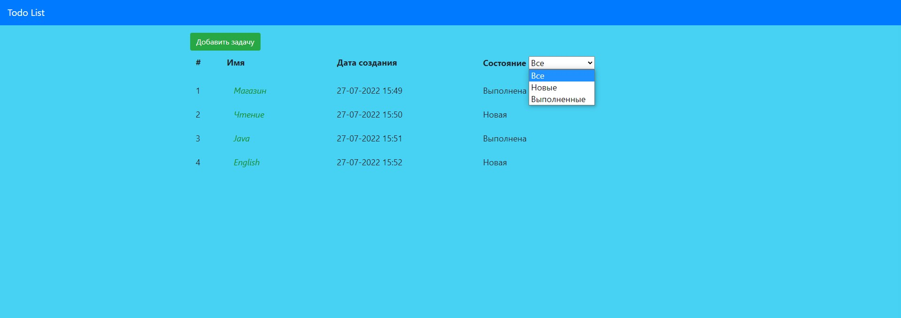
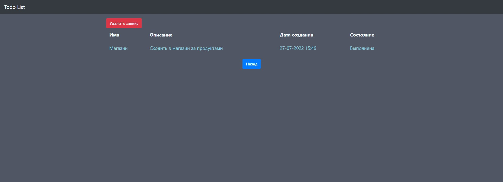
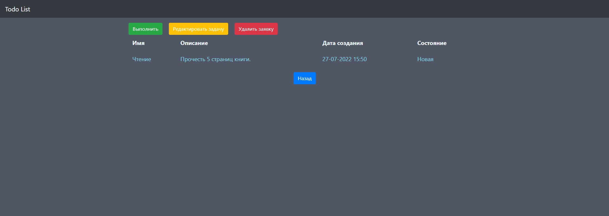
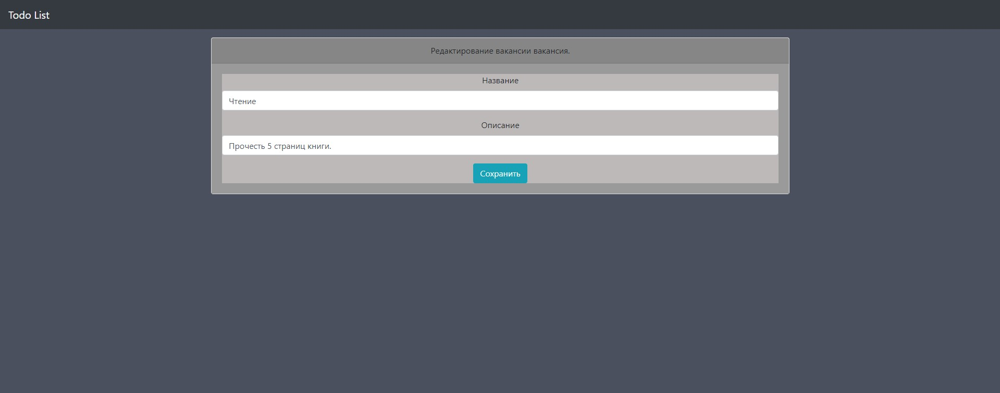
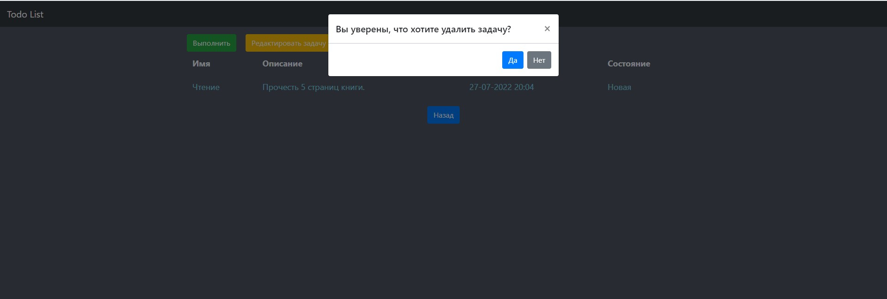

# 
Todo List

<h5>Todo List - Это простой список задач. Нужен  чтобы контролировать и не забывать дела, которые нужно сделать в течении дня.</h5>

## 
Гайд по проекту
 

### 
Главная страница
 

<h5 style="text-align: center">Здесь находится весь список задач. Их можно сортировать: "Все, Выполненные, Новые". Каждую задачу можно выбрать, прочесть её описание, удалить, редактировать или присвоить статус Выполнено. Так же тут находится кнопка ".
Добавить новую задачу".</h5>

***
### 
Страница для добавления новой задачи
 
<h5 style="text-align: center">Здесь находится форма. Пишем название задачи и её описания.</h5>

***
### 
Страница выполненой задачи
 
<h5 style="text-align: center">Редактировать, как и выполнить её больше нельзя. Есть возможно только удалить.</h5>

***
### 
Страница новой задачи
 
<h5 style="text-align: center">Её возможно выполнить, редактировать или удалить.</h5>

***
### 
Форма редактирования задачи
 
<h5 style="text-align: center">Здесь можно редактировать новую задачу.</h5>

***
### 
Удаление задачи
 
<h5 style="text-align: center">При нажатии на кнопку "Удалить задачу" появляется всплывающее окно, которое просить подтвердить, что вы хотите удалить задачу.</h5>

