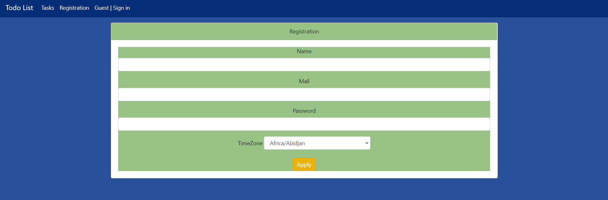
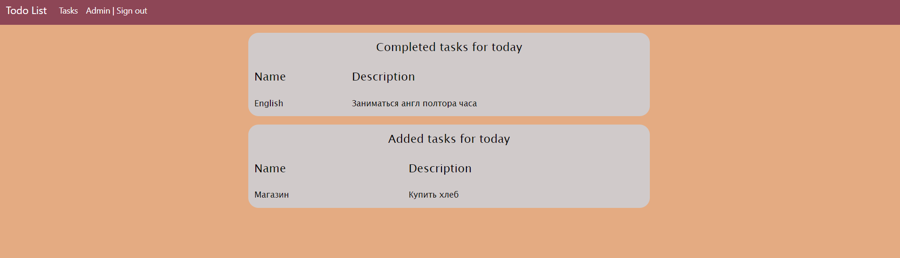
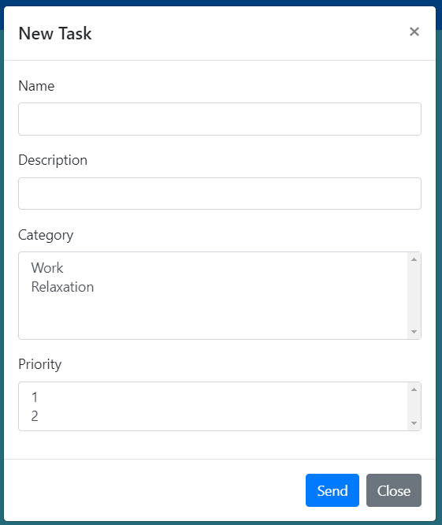

# <p style="text-align: center;">Todo List</p>

<a name="menu"></a>
<ul>
    <li>
        <a href="#about">О проекте</a>
        <ul>
            <li><a href="#description">Описание</a></li>
            <li><a href="#technologies">Технологии</a></li>
        </ul>
    </li>
    <li>
        <a href="#build">Сборка</a>
    </li>
    <li>
        <a href="#usage">Использование</a>
        <ul>
            <li><a href="#registration">Страница регистрации</a></li>
            <li><a href="#singIn">Страница входа</a></li>
            <li><a href="#hall">Главная страница</a></li>
            <li><a href="#listTask">Список задач</a></li>
            <li><a href="#addTask">Добавление задачи</a></li>
            <li><a href="#taskDescription">Описание задачи</a></li>
            <li><a href="#newTask">Страница новой задачи</a></li>
            <li><a href="#oldTask">Страница выполненой задачи</a></li>
            <li><a href="#deleteTask">Удаление задачи</a></li>
            <li><a href="#editTask">Редактирование задачи</a></li>
        </ul>
    </li>
</ul>

<h2><a name="about">О проекте</a>&nbsp;&nbsp;<a href="#menu">&#9650;</a></h2>
<h4><a name="description">Описание</a>&nbsp;&nbsp;<a href="#menu">&#9650;</a></h4>
<p>
Todo List - Это простой список задач. Нужен  чтобы контролировать и не забывать дела, которые нужно сделать в течении дня.
</p>

<h4><a name="technologies">Технологии</a>&nbsp;&nbsp;<a href="#menu">&#9650;</a></h4>
<ul>
    <li>Java 17</li>
    <li>Hibernate, PostgreSQL, Liquibase</li>
    <li>Maven</li>
    <li>Spring boot</li>
    <li>HTML, CSS, Bootstrap, Thymeleaf, JavaScript</li>
</ul>

</code></pre>

<h2><a name="build">Сборка</a>&nbsp;&nbsp;<a href="#menu">&#9650;</a></h2>
<ol>
    <li>
        Для успешной сборки и работы проекта на вашем компьютере должны быть установлены:
        <ol>
            <li>JDK 17(+)</li>
            <li>Maven</li>
            <li>PostgreSQL</li>
        </ol>
    </li>
    <li>
        В PostgreSQL создайте базу с именем "todo"
    </li>
    <li>
        Скачайте проект к себе на компьютер с помощью команды<br>
        <code>git clone git@github.com:ValeraDanilov/job4j_todo.git</code><br>
        Перейдите в корень проекта
    </li>
    <li>
        Добавьте настройки для доступа к базе данных, для этого внесите соответствующие изменения в файле 
        <code>src/main/resources/db.properties</code><br>
        и в файле конфигурации проекта <code>pom.xml</code>

``` 
<profile>   
    <id>production</id>
    <properties>
        <db.url>jdbc:postgresql://127.0.0.1:5432/todo</db.url>
        <db.username>postgres</db.username>
        <db.password>password</db.password>
        <db.driver>org.postgresql.Driver</db.driver>
    </properties>
</profile>
```

</li>
    <li>
        Выполните команду <code>mvn install</code> в корне проекта для его сборки<br>
        Будет выполнена миграция БД с помощью Liquibase.<br>
    </li>
    <li>
        Команда для запуска из консоли <code>java -jar target/todo-1.0.jar</code> после чего перейдите по данной ссылке.<br>
        <a href="http://localhost:8080/index/">http://localhost:8080/index</a>
    </li>
</ol>

<h2><a name="usage">Использование</a>&nbsp;&nbsp;<a href="#menu">&#9650;</a></h2>

<h3><a name="registration">Страница регистрации</a>&nbsp;&nbsp;<a href="#menu">&#9650;</a></h3>
<p>
    Страница регистрации. Без регистрации вы не сможете пользоваться данным ресурсом. Регистрация обязательная.
</p>
<p style="text-align: center">
  
</p>
<h3><a name="singIn">Страница входа</a>&nbsp;&nbsp;<a href="#menu">&#9650;</a></h3>
<p>
   Страница входа.
</p>
<p style="text-align: center">
  
</p>
<h3><a name="hall">Главная страница</a>&nbsp;&nbsp;<a href="#menu">&#9650;</a></h3>
<p>
  Главная страница. Тут отображаются новые и выполнение задачи за последние сутки.
</p>
<p style="text-align: center">
  
</p>
<h3><a name="listTask">Список задач</a>&nbsp;&nbsp;<a href="#menu">&#9650;</a></h3>
<p>
    Список всех задач. Их можно сортировать на (All - Все, New, Новые, Done - Выполненые).
</p>
<p style="text-align: center">
  
</p>
<h3><a name="addTask">Добавление задачи</a>&nbsp;&nbsp;<a href="#menu">&#9650;</a></h3>
<p>
   Окно для добавления новой задачи.
</p>
<p style="text-align: center">
  
</p>
<h3><a name="taskDescription">Описание задачи</a>&nbsp;&nbsp;<a href="#menu">&#9650;</a></h3>
<p>
Нажав на определённую задачу. можно увидеть подробную информацию о ней.
После выполнение данной задачи тут есть кнопка Run. Нажав на неё, она приобретет статус (Done) выполненой.
</p>
<p style="text-align: center">
  
</p>
<h3><a name="newTask">Страница новой задачи</a>&nbsp;&nbsp;<a href="#menu">&#9650;</a></h3>
<p>
Её возможно выполнить, редактировать или удалить.
</p>
<p style="text-align: center">
  
</p>
<h3><a name="oldTask">Страница выполненой задачи</a>&nbsp;&nbsp;<a href="#menu">&#9650;</a></h3>
<p>
Редактировать, как и выполнить её больше нельзя. Есть возможно только удалить.
</p>
<p style="text-align: center">
  
</p>
<h3><a name="deleteTask">Удаление задачи</a>&nbsp;&nbsp;<a href="#menu">&#9650;</a></h3>
<p>
При нажатии на кнопку "Удалить задачу"
появляется всплывающее окно, которое просить подтвердить, что вы хотите удалить задачу.
</p>
<p style="text-align: center">
  
</p>
<h3><a name="editTask">Редактирование задачи</a>&nbsp;&nbsp;<a href="#menu">&#9650;</a></h3>
<p>
На странице Описание задачи есть кнопка для её редактирования.
<p style="text-align: center">
  
